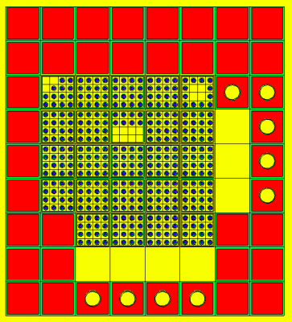

# MCNP HF QTU3QF

Homework for the Neutron and Gamma Transport Calculation Methods (BMETE80NE21) course at Budapest University of Technology and Economics.

## Task

- Build a simplified model of the BME training reactor
- Insert it inside a large body of water
- Define a container made of concrete around the water
- Determine the dose rate on the outside of this container

## Geometry

Based on the 2018 benchmark the training reactor was modelled using **MCNP** with simplifications according to the expected geometry shown in the figure above.

The reactor core consists of a _8x9_ grid of cells.
Introduce a coordinate system at the top left corner of this grid to reference cells, along the _x_ axis label the cells as **_A_** to **_H_** and along the _y_ axis label them with numbers ranging **_1_** through **_9_**.

The following table displays if a grid element is a fuel cell (**FC**), control cell (**G**) or empty (_E_) (filled with water).

|         | **_A_** | **_B_** | **_C_** | **_D_** | **_E_** | **_F_** | **_G_** | **_H_** |
|---|---|---|---|---|---|---|---|---|
| **_1_** |  **G**  |  **G**  |  **G**  |  **G**  |  **G**  |  **G**  |  **G**  |  **G**  |
| **_2_** |  **G**  |  **G**  |  **G**  |  **G**  |  **G**  |  **G**  |  **G**  |  **G**  |
| **_3_** |  **G**  | **FC**  | **FC**  | **FC**  | **FC**  | **FC**  |  **G**  |  **G**  |
| **_4_** |  **G**  | **FC**  | **FC**  | **FC**  | **FC**  | **FC**  |    _E_  |  **G**  |
| **_5_** |  **G**  | **FC**  | **FC**  | **FC**  | **FC**  | **FC**  |    _E_  |  **G**  |
| **_6_** |  **G**  | **FC**  | **FC**  | **FC**  | **FC**  | **FC**  |    _E_  |  **G**  |
| **_7_** |  **G**  |  **G**  | **FC**  | **FC**  | **FC**  | **FC**  |  **G**  |  **G**  |
| **_8_** |  **G**  |  **G**  |    _E_  |    _E_  |    _E_  |    _E_  |  **G**  |  **G**  |
| **_9_** |  **G**  |  **G**  |  **G**  |  **G**  |  **G**  |  **G**  |  **G**  |  **G**  |

The differenc types of fuel cells and their locations are specified in the following chapters.

## Cells

The bounding geometry for all types of cells defined matches and uses the same parameters.
The edge length of each lattice element is _e_, _h_ is the cell height, the inner box side length is _a_.
Each inner box is surrounded by an aluminum wall on the sides with a width _w_.

|  | Value | Unit |
|---|---|---|
| _e_ | 7.2 | cm |
| _h_ | 60 | cm |
| _a_ | 6.5 | cm |
| _w_ | 1.5 | mm |

---

### Fuel Cells

The reactor core contains 4 types of different fuel cell arangements, each cell is a _4x4_ matrix with fields either containing a fuel rod (**1**) or is empty (**0**) (filled with water).

**Filled Cell**

Each field contains a fuel rod.

| | | | |
|---|---|---|---|
| **1** | **1** | **1** | **1** |
| **1** | **1** | **1** | **1** |
| **1** | **1** | **1** | **1** |
| **1** | **1** | **1** | **1** |

**Half-Filled Cell**

Only the top half of the fields contain fuel rods.
In the reference coordinate system: **_D4_**

| | | | |
|---|---|---|---|
| **1** | **1** | **1** | **1** |
| **1** | **1** | **1** | **1** |
| **0** | **0** | **0** | **0** |
| **0** | **0** | **0** | **0** |

**Middle-Empty Cell**

The middle fields of the cell are empty.
In the reference coordinate systm: **_F3_**

| | | | |
|---|---|---|---|
| **1** | **1** | **1** | **1** |
| **1** | **0** | **0** | **1** |
| **1** | **0** | **0** | **1** |
| **1** | **1** | **1** | **1** |

**Corner-Empty Cell**

The top left corner triangle of the cell is empty.
In the reference coordinate system: **_B3_**

| | | | |
|---|---|---|---|
| **0** | **0** | **1** | **1** |
| **0** | **1** | **1** | **1** |
| **1** | **1** | **1** | **1** |
| **1** | **1** | **1** | **1** |

---

#### Fuel Rod

The simplified geometry of a fuel rod consists of two cylinders, the inner is made of _UO2_ and is defined by radius _r_ and length _l_, while the outer is made of _Al_ with a radius _R_ and lenght _L_.
The inner cylinder sits right in the middle of the outer one.
The fuel rods are fit into the cells with a lattice, the edge length of these lattice elements is _b_, dividing the space evenly for the _4x4_ fuel cell lattice, meaning a size of _a/4_.

|  | Value | Unit |
|---|---|---|
| _l_ | 500 | mm |
| _L_ | 590 | mm |
| _r_ | 3.5 | mm |
| _R_ | 5 | mm |
| _b_ | 1.625 | cm |

---

### Control Cells

Cells that don't contain fuel rods.

**Full Cell**

A cell filled with graphite.

**Holed Cell**

A cell filled with graphite with a cylindrical hole in the middle with a diameter _d_, which is filled with water.
This hole also has a same width (_w_) aluminum wall around it.

|  | Value | Unit |
|---|---|---|
| _d_ | 2.9 | cm |
| _w_ | 1.5 | mm |

In the model these are the following grid elements:
**_G3, H3-H6, C9-F9_**

## Container and Importance Layers

The reactor core is submerged in water, in the model it sits in the middle of a cylinder with a diameter _D_.
Around this a container made of concrete is defined with a width of _W_. Resulting in two concentric cylinders.
The height of both cylinders is the same _H_.

|  | Value | Unit |
|---|---|---|
| _H_ | 200 | cm |
| _D_ | 140 | cm |
| _W_ | 0.5 | m |

Each cylinder is divided into 10 cm wide importance layers.
The effective diameter of the reactor core with the _8x9_ lattice can be calculated as the following:

$$D_\text{core} = \sqrt{(8e)^2 + (9e)^2} = e\sqrt{8^2 + 9^2} = 7.2 \cdot \sqrt{145} \approx 86.7 \ \text{cm}$$

Since the effective diameter is 86.7 cm, the inner most importance layer is defined with a diameter of 100 cm.

| # | Value | Unit | Importance | Material |
|---|---|---|---|---|
| _1_ | 240 | cm | $2^8=$ `256` | concrete |
| _2_ | 220 | cm | $2^7=$ `128` | concrete |
| _3_ | 200 | cm | $2^6=$ `64` | concrete |
| _4_ | 180 | cm | $2^5=$ `32` | concrete |
| _5_ | 160 | cm | $2^4=$ `16` | concrete |
| _6_ | 140 | cm | $2^3=$ `8` | water |
| _7_ | 120 | cm | $2^2=$ `4` | water |
| _8_ | 100 | cm | $2^1=$ `2` | water |

These are centered around the core, also the coordinate system, so the middle of these is at _(x,y) = (0,0)_.
The region outside of the largest cylinder is void and its importance is zero, `0`.

## Materials

The materials used in the model and their **ZAID** definitions are collected in the following table.

| # | Name | ZAID-MCNP definition | Description |
|---|---|---|---|
| 1 | uranium | `92235.50c 0.1` `92238.50c 0.9` `8016.50c 2` | Fuel meat: 10 % enriched UO₂. **Atom fractions** — U-235/(U-235 + U-238) = 0.1/0.9 → 10 % enrichment, with O-16 at twice the total uranium (UO₂ stoichiometry). |
| 2 | water | `1001.50c 2 8016.50c 1` | Light-water moderator and coolant filling the lattice gaps and the tank. Given as **atom fractions** in a 2:1 ratio of H-1 to O-16, i.e. H₂O. |
| 3 | aluminium | `13027.50c 1` | Structural material: fuel-rod cladding, assembly boxes and the outer tank wall. Single nuclide Al-27 (atom fraction 1). |
| 4 | graphite | `6012.50c 1` | Graphite moderator / reflector blocks. Single nuclide C-12 (atom fraction 1). |
| 5 | concrete | `1001.50c -0.01` `6012.50c -0.001` `8016.50c -0.529107` `11023.51c -0.016` `12000.51c -0.002` `13027.50c -0.033872` `14000.51c -0.337021` `19000.51c -0.013` `20000.51c -0.044` `26000.55c -0.014` | Biological shielding surrounding the core. **Weight fractions** (negative entries) of ordinary concrete, dominated by oxygen (≈ 52.9 %) and silicon (≈ 33.7 %), with H, C, Na, Mg, Al, K, Ca and Fe making up the remainder (the ten fractions sum to 1.0). |

> In MCNP a **positive** entry is an atom (number) fraction and a **negative** entry is a mass (weight) fraction. The `.50c` / `.51c` / `.55c` suffixes select the continuous-energy cross-section evaluation used for each nuclide.

## Source

The simulation should use a single source in the fuel cell at **_D5_** at the center of the following fuel rod defince as **SRC**

| | | | |
|---|---|---|---|
| **1** | **1** | **1** | **1** |
| **1** | **1** | **1** | **SRC** |
| **1** | **1** | **1** | **1** |
| **1** | **1** | **1** | **1** |

The model is run as a criticality (_k_-eff) calculation, like the example decks. The **SRC** rod marks the **`KSRC`** seed point that starts the first cycle; the fission source then converges over the inactive cycles across all fuel cells.

| Card | Definition | Description |
|---|---|---|
| `MODE` | `n` | Neutron transport only. |
| `KCODE` | `2000 1.0 20 220` | 2000 histories per cycle, initial _k_-guess of 1.0, 20 inactive (skipped) cycles and 220 total cycles (200 active). |
| `KSRC` | `-1.1625 0.8125 0` | Initial source point at the centre of the **SRC** rod in cell _D5_. |

The seed coordinate follows from the core-centred origin: cell _D5_ is centred at _(x, y) = (-3.6, 0)_ (cell pitch _e_), and the **SRC** rod (row 2, column 4 of the _4x4_, pitch _b_) is offset by _(+2.4375, +0.8125)_, giving _(-1.1625, 0.8125, 0)_ at _z = 0_.

## Tally

The dose rate is determined on the **outer surface of the concrete container**, i.e. the largest importance cylinder (_D_ = 240 cm). A neutron surface-flux tally (`F2`) is converted to a dose rate with a fluence-to-dose function and scaled to the reactor's nominal power.

| Card | Definition | Description |
|---|---|---|
| `F2` | `n` (outer concrete surface) | Average neutron flux across the outer wall (the _D_ = 240 cm cylinder). |
| `FM2` | `2.934e13` | Scales the per-source-neutron tally to an absolute dose rate at the nominal power. Combines the source strength (100 kW → _S_ ≈ 8.15·10¹⁵ n/s) with the 3.6·10⁻³ factor that converts pSv/s to µSv/h. |
| `DE2` / `DF2` | energy / dose-factor pairs | Neutron fluence-to-effective-dose conversion (ICRP-116, Table A.5, AP geometry); turns the flux into an effective dose. |
| `E2` | `0.5e-6 0.5 20` | _(optional)_ thermal / epithermal / fast energy bins. |

So `F2` gives the flux leaking through the outer wall, `DE2`/`DF2` folds it into an effective dose per source neutron, and `FM2` scales that to the absolute dose rate at full power — the final tally is the **dose rate outside the container** in µSv/h.
